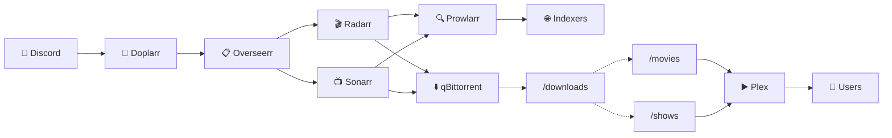

# 🎬 Media Server Stack

A complete, automated media server setup using Docker. Request movies and TV shows through Discord, and they automatically download and appear in Plex.



> 💡 For an animated version, paste [`docs/architecture.mermaid`](docs/architecture.mermaid) into [fanfa.dev](https://fanfa.dev)

## 🔄 How It Works

```
┌─────────────────────────────────────────────────────────────────────────────┐
│                              REQUEST FLOW                                    │
└─────────────────────────────────────────────────────────────────────────────┘

  Discord          Doplarr         Overseerr        Radarr/Sonarr
     │                │                │                  │
     │  /request      │                │                  │
     │  movie         │                │                  │
     │ ──────────────>│                │                  │
     │                │  API Request   │                  │
     │                │ ──────────────>│                  │
     │                │                │  Movie Request   │
     │                │                │ ────────────────>│
     │                │                │                  │


┌─────────────────────────────────────────────────────────────────────────────┐
│                              SEARCH & DOWNLOAD                               │
└─────────────────────────────────────────────────────────────────────────────┘

  Radarr/Sonarr     Prowlarr        Indexers        qBittorrent
     │                │                │                  │
     │  Search        │                │                  │
     │ ──────────────>│                │                  │
     │                │  Query         │                  │
     │                │ ──────────────>│                  │
     │                │                │                  │
     │                │  Results       │                  │
     │                │ <──────────────│                  │
     │  Send Torrent  │                │                  │
     │ ───────────────────────────────────────────────────>
     │                │                │                  │


┌─────────────────────────────────────────────────────────────────────────────┐
│                              IMPORT & STREAM                                 │
└─────────────────────────────────────────────────────────────────────────────┘

  qBittorrent      /downloads       /movies          Plex           Users
     │                │                │                │              │
     │  Save          │                │                │              │
     │ ──────────────>│                │                │              │
     │                │  Import        │                │              │
     │                │ ──────────────>│                │              │
     │                │                │  Scan          │              │
     │                │                │ ──────────────>│              │
     │                │                │                │  Stream      │
     │                │                │                │ ────────────>│
```

## 📋 What's Included

| Service | Purpose | Port |
|---------|---------|------|
| **Plex** | Media streaming server | 32400 |
| **Overseerr** | Request management UI | 5055 |
| **Radarr** | Movie management & automation | 7878 |
| **Sonarr** | TV show management & automation | 8989 |
| **Prowlarr** | Indexer management | 9696 |
| **qBittorrent** | Torrent download client | 8080 |
| **Doplarr** | Discord bot for requests | - |

## 🚀 Quick Start

### Prerequisites

- Docker and Docker Compose
- Discord account (for the request bot)
- Indexer accounts (torrent sites)
- Plex account

### 1. Clone and Setup

```bash
git clone https://github.com/YOUR_USERNAME/media-stack.git
cd media-stack
mkdir -p config/{plex,overseerr,radarr,sonarr,prowlarr,qbittorrent,doplarr}
mkdir -p media/{Downloads,Movies,Shows}
cp .env.example .env
```

### 2. Configure Environment

Edit `.env` with your values:

```env
TZ=America/Toronto
PLEX_CLAIM=                    # Optional, get from https://plex.tv/claim
DISCORD_TOKEN=your_token       # From Discord Developer Portal
OVERSEERR_API=your_api_key     # Get after Overseerr setup
```

### 3. Start the Stack

```bash
docker-compose up -d
```

### 4. Configure Services (in order)

#### a) qBittorrent → http://localhost:8080
- Default login: `admin` / `adminadmin` (change immediately)
- Verify download path is `/downloads`

#### b) Prowlarr → http://localhost:9696
- Add your indexers (torrent sites)
- Settings → Apps → Add Radarr (`http://radarr:7878`) and Sonarr (`http://sonarr:8989`)

#### c) Radarr → http://localhost:7878
- Settings → Media Management → Add Root Folder: `/data/Movies`
- Settings → Download Clients → Add qBittorrent (host: `qbittorrent`, port: `8080`)

#### d) Sonarr → http://localhost:8989
- Settings → Media Management → Add Root Folder: `/data/Shows`
- Settings → Download Clients → Add qBittorrent (host: `qbittorrent`, port: `8080`)

#### e) Plex → http://localhost:32400/web
- Add libraries: Movies → `/movies`, TV Shows → `/tv`

#### f) Overseerr → http://localhost:5055
- Sign in with Plex
- Add Radarr/Sonarr servers (use container names as hosts)
- Copy API key from Settings → General for Doplarr

#### g) Doplarr
- Update `.env` with `OVERSEERR_API` key
- Restart: `docker-compose restart doplarr`

## 🤖 Discord Bot Setup

1. Go to [Discord Developer Portal](https://discord.com/developers/applications)
2. Create **New Application** → Go to **Bot** → **Add Bot**
3. Copy **Token** → paste in `.env` as `DISCORD_TOKEN`
4. Enable **Message Content Intent**
5. **OAuth2** → **URL Generator**: select `bot` + `applications.commands`, permissions: `Send Messages`, `Embed Links`, `Read Message History`
6. Use generated URL to invite bot to your server

### Using the Bot

```
/request movie Inception
/request tv Breaking Bad
```

## 🔧 Tips

### Hardlinks (Save Space)
The docker-compose maps `/data` as parent volume. Configure *arr apps to use `/data/Downloads`, `/data/Movies`, `/data/Shows` for hardlinks instead of copies.

### Seed Ratio
qBittorrent → Options → BitTorrent → Seeding Limits → set ratio and action when reached.

## 🐛 Troubleshooting

| Issue | Solution |
|-------|----------|
| *arr apps: "path does not exist" | Check volume mappings, ensure folders exist, restart container |
| Overseerr: empty root folder dropdown | Add root folder in Radarr/Sonarr first, restart Overseerr |
| Discord commands don't appear | Wait up to 1 hour, check Message Content Intent, check logs |
| Downloads not importing | Check Activity → Queue in *arr app for errors |

```bash
# View logs
docker-compose logs -f radarr

# Restart service
docker-compose restart radarr
```

## 📝 License

MIT

## 🙏 Credits

[LinuxServer.io](https://linuxserver.io) • [Overseerr](https://overseerr.dev) • [Radarr](https://radarr.video) • [Sonarr](https://sonarr.tv) • [Prowlarr](https://prowlarr.com) • [Doplarr](https://github.com/kiranshila/Doplarr)
