# 🎬 Media Server Stack

A complete, automated media server setup using Docker. Request movies and TV shows through Discord, and they automatically download and appear in Plex.


## 📋 What's Included

| Service | Purpose | Port |
|---------|---------|------|
| **Plex** | Media streaming server | 32400 |
| **Overseerr** | Request management UI | 5055 |
| **Radarr** | Movie management & automation | 7878 |
| **Sonarr** | TV show management & automation | 8989 |
| **Prowlarr** | Indexer management | 9696 |
| **qBittorrent** | Torrent download client | 8080 |
| **Doplarr** | Discord bot for requests | - |

## 🔄 How It Works

```
┌─────────────────────────────────────────────────────────────────────────────┐
│                              REQUEST FLOW                                    │
└─────────────────────────────────────────────────────────────────────────────┘

  Discord          Doplarr         Overseerr        Radarr/Sonarr
     │                │                │                  │
     │  /movie        │                │                  │
     │  Inception     │                │                  │
     │ ──────────────>│                │                  │
     │                │  API Request   │                  │
     │                │ ──────────────>│                  │
     │                │                │  Movie Request   │
     │                │                │ ────────────────>│
     │                │                │                  │


┌─────────────────────────────────────────────────────────────────────────────┐
│                              SEARCH & DOWNLOAD                               │
└─────────────────────────────────────────────────────────────────────────────┘

  Radarr/Sonarr     Prowlarr        Indexers        qBittorrent
     │                │                │                  │
     │  Search        │                │                  │
     │ ──────────────>│                │                  │
     │                │  Query         │                  │
     │                │ ──────────────>│                  │
     │                │                │                  │
     │                │  Results       │                  │
     │                │ <──────────────│                  │
     │  Send Torrent  │                │                  │
     │ ───────────────────────────────────────────────────>
     │                │                │                  │


┌─────────────────────────────────────────────────────────────────────────────┐
│                              IMPORT & STREAM                                 │
└─────────────────────────────────────────────────────────────────────────────┘

  qBittorrent      /downloads       /movies          Plex           Users
     │                │                │                │              │
     │  Save          │                │                │              │
     │ ──────────────>│                │                │              │
     │                │  Import        │                │              │
     │                │ ──────────────>│                │              │
     │                │                │  Scan          │              │
     │                │                │ ──────────────>│              │
     │                │                │                │  Stream      │
     │                │                │                │ ────────────>│
```

## 🚀 Quick Start

### Prerequisites

- Docker and Docker Compose installed
- A Discord account (for the request bot)
- Indexer accounts (torrent sites like IPTorrents, etc.)
- Plex account

### 1. Clone the Repository

```bash
git clone https://github.com/YOUR_USERNAME/media-stack.git
cd media-stack
```

### 2. Create Directory Structure

```bash
mkdir -p config/{plex,overseerr,radarr,sonarr,prowlarr,qbittorrent,doplarr}
mkdir -p media/{Downloads,Movies,Shows}
```

### 3. Configure Environment Variables

```bash
cp .env.example .env
```

Edit `.env` with your values:

```env
# Timezone (find yours: https://en.wikipedia.org/wiki/List_of_tz_database_time_zones)
TZ=America/Toronto

# Plex claim token (get from https://plex.tv/claim) - optional, for first setup
PLEX_CLAIM=

# Discord bot token (from Discord Developer Portal)
DISCORD_TOKEN=your_discord_bot_token

# Overseerr API key (get after Overseerr setup)
OVERSEERR_API=your_overseerr_api_key
```

### 4. Start the Stack

```bash
docker-compose up -d
```

### 5. Configure Services (in order)

#### a) qBittorrent
1. Open http://localhost:8080
2. Default login: `admin` / `adminadmin`
3. **Change the password immediately**
4. Verify download path is `/downloads`

#### b) Prowlarr
1. Open http://localhost:9696
2. Add your indexers (torrent sites)
3. Go to Settings → Apps → Add Radarr and Sonarr:
   - Radarr: `http://radarr:7878`
   - Sonarr: `http://sonarr:8989`
   - Get API keys from each app's Settings → General

#### c) Radarr
1. Open http://localhost:7878
2. Settings → Media Management → Add Root Folder: `/movies`
3. Settings → Download Clients → Add qBittorrent:
   - Host: `qbittorrent`
   - Port: `8080`
   - Username/Password from step (a)

#### d) Sonarr
1. Open http://localhost:8989
2. Settings → Media Management → Add Root Folder: `/tv`
3. Settings → Download Clients → Add qBittorrent:
   - Host: `qbittorrent`
   - Port: `8080`
   - Username/Password from step (a)

#### e) Plex
1. Open http://localhost:32400/web
2. Sign in and set up your server
3. Add libraries:
   - Movies → `/movies`
   - TV Shows → `/tv`

#### f) Overseerr
1. Open http://localhost:5055
2. Sign in with Plex
3. Add Radarr server:
   - Host: `radarr`
   - Port: `7878`
   - API Key from Radarr → Settings → General
   - Select root folder and quality profile
4. Add Sonarr server (same process)
5. Copy API key from Settings → General (for Doplarr)

#### g) Doplarr (Discord Bot)
1. Update `.env` with your `OVERSEERR_API` key
2. Restart Doplarr: `docker-compose restart doplarr`
3. Invite bot to your Discord server (see Discord Setup below)

## 🤖 Discord Bot Setup

1. Go to [Discord Developer Portal](https://discord.com/developers/applications)
2. Click **New Application** → name it (e.g., "Media Requests")
3. Go to **Bot** → **Add Bot**
4. Copy the **Token** → paste in `.env` as `DISCORD_TOKEN`
5. Enable **Message Content Intent** under Privileged Gateway Intents
6. Go to **OAuth2** → **URL Generator**:
   - Scopes: `bot`, `applications.commands`
   - Bot Permissions: `Send Messages`, `Embed Links`, `Read Message History`
7. Copy the generated URL → open in browser → invite to your server

### Using the Bot

In any Discord channel:
- `/movie Inception` - Request a movie
- `/tv Breaking Bad` - Request a TV show

## 📁 Directory Structure

```
media-stack/
├── docker-compose.yml
├── .env
├── .env.example
├── README.md
├── config/
│   ├── plex/
│   ├── overseerr/
│   ├── radarr/
│   ├── sonarr/
│   ├── prowlarr/
│   ├── qbittorrent/
│   └── doplarr/
├── media/
│   ├── Downloads/    # Temporary download location
│   ├── Movies/       # Organized movie library
│   └── Shows/        # Organized TV library
└── docs/
    └── architecture.png
```

## 🔧 Configuration Tips

### Enable Hardlinks (Save Space)

By default, files are copied from `/downloads` to `/movies` or `/shows`. To use hardlinks (same file, no extra space), all paths must be on the same filesystem.

The docker-compose already maps a parent `/data` volume for this. Configure your *arr apps to use:
- Download path: `/data/Downloads`
- Movie root: `/data/Movies`
- TV root: `/data/Shows`

### Seed Ratio Settings

In qBittorrent → Options → BitTorrent → Seeding Limits:
- Set your preferred ratio (e.g., 1.0)
- Enable "Pause torrent" or "Remove torrent" when reached

### Notifications

Each *arr app supports notifications. Go to Settings → Connect to add:
- Discord webhooks
- Email
- Pushover
- And more

## 🐛 Troubleshooting

### *arr apps show "path does not exist"
- Check volume mappings in docker-compose.yml
- Ensure folders exist and have correct permissions
- Restart the container after changes

### Overseerr can't find root folders
- Ensure root folder is added in Radarr/Sonarr first
- Restart Overseerr after configuring *arr apps

### Discord bot commands don't appear
- Wait up to 1 hour for Discord to register slash commands
- Ensure Message Content Intent is enabled
- Check Doplarr logs: `docker-compose logs doplarr`

### Downloads not importing
- Check *arr app → Activity → Queue for errors
- Verify download client is connected
- Check file permissions

### View logs
```bash
# All services
docker-compose logs -f

# Specific service
docker-compose logs -f radarr
```

### Restart services
```bash
# All services
docker-compose restart

# Specific service
docker-compose restart radarr
```

## 📊 Architecture Diagram

For an interactive, animated version of the architecture diagram, paste the contents of `docs/architecture.mermaid` into [fanfa.dev](https://fanfa.dev).

```mermaid
flowchart TB
    subgraph USER["👥 User Interface"]
        Discord["💬 Discord"]
        Doplarr["🤖 Doplarr"]
    end

    subgraph REQUESTS["📋 Request Management"]
        Overseerr["📋 Overseerr"]
    end

    subgraph AUTOMATION["⚙️ Media Automation"]
        Radarr["🎬 Radarr"]
        Sonarr["📺 Sonarr"]
        Prowlarr["🔍 Prowlarr"]
    end

    Discord -->|"/movie or /tv"| Doplarr
    Doplarr -->|"API"| Overseerr
    Overseerr --> Radarr
    Overseerr --> Sonarr
    Radarr --> Prowlarr
    Sonarr --> Prowlarr
    Prowlarr -->|"Search"| Indexers["🌐 Indexers"]
    Radarr --> qBit["⬇️ qBittorrent"]
    Sonarr --> qBit
    qBit --> Downloads["/downloads"]
    Downloads -.-> Movies["/movies"]
    Downloads -.-> Shows["/shows"]
    Movies --> Plex["▶️ Plex"]
    Shows --> Plex
    Plex -->|"Stream"| Users["👨‍👩‍👧‍👦 Users"]
```



## 📝 License

MIT License - feel free to use and modify as needed.

## 🙏 Credits

- [LinuxServer.io](https://linuxserver.io) for the Docker images
- [Overseerr](https://overseerr.dev)
- [Radarr](https://radarr.video)
- [Sonarr](https://sonarr.tv)
- [Prowlarr](https://prowlarr.com)
- [Doplarr](https://github.com/kiranshila/Doplarr)
